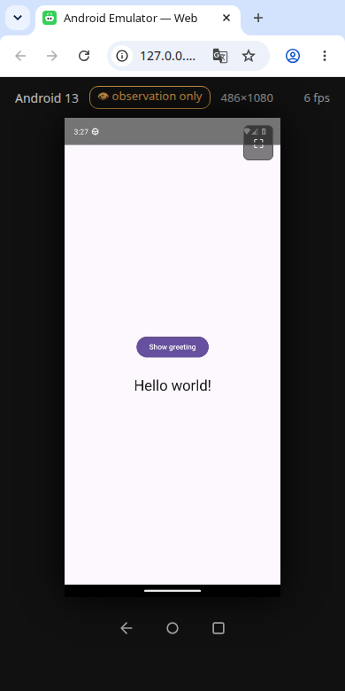

# DroidLab MCP

[](LICENSE)
[](https://nodejs.org)
[](https://modelcontextprotocol.io)

**Android emulator under full control of an AI agent.** DroidLab is an MCP (Model Context Protocol) server that lets any MCP client — Claude Desktop, OpenCode, Cursor, a custom agent — boot an Android emulator, drive its UI (tap / swipe / type / keys), read the screen (screenshot + UI element tree), install APKs, read logs, and use the clipboard. While the agent works, a human can watch the live screen in a regular browser over the local network.

> **Agent first.** The MCP server is the product; the browser is the observation deck. An agent can set up and use the entire toolset without any human in the loop.

```
[MCP client / agent] ──stdio──> [MCP server] ──adb──> [Android emulator]
                                     │
[Browser / human] <──WebSocket──> [Node.js bridge] <──┘  (video + input relay)
   H.264 via WebCodecs
```

<p align="center">
  
</p>
<p align="center"><em>The stream is a normal web page in any browser — desktop or phone. The agent drives a real app over MCP (tap → <code>Hello world!</code>) while a human just opens a URL and watches.</em></p>

## Table of contents

- [Requirements](#requirements)
- [Agent quick start](#agent-quick-start)
- [Tools](#tools)
- [Resources](#resources)
- [Human quick start](#human-quick-start)
- [Architecture](#architecture)
- [Security model](#security-model)
- [Configuration](#configuration)
- [WebSocket protocol](#websocket-protocol)
- [Latency model](#latency-model)
- [Troubleshooting](#troubleshooting)
- [License](#license)

## Requirements

| Dependency | Notes |
|---|---|
| Node.js ≥ 18 | bridge + MCP server |
| Android SDK | `emulator`, `platform-tools` (adb); `ANDROID_HOME` or default paths |
| scrcpy 4.x | H.264 stream + control channel; `~/bin/scrcpy/` by default |
| openssl | self-signed TLS cert for the bridge (HTTPS) |

Linux, macOS and Windows are supported. The bridge serves HTTPS (self-signed cert, generated on first start) because WebCodecs `VideoDecoder` requires a secure context. Open the access URL once and accept the certificate warning ("Continue to droidlab.local / unsafe").

**Self-bootstrap:** missing pieces are downloaded on demand. `env_start` creates a missing AVD by itself — it derives the API level from the AVD name (`API33` → `system-images;android-33;google_apis;<host ABI>`, arm64 hosts get `arm64-v8a`), downloads the image via `sdkmanager` (pending SDK licenses are auto-accepted, 30-min cap) and runs `avdmanager create avd -d pixel_7`. If `sdkmanager`/`avdmanager` are absent, the official cmdline-tools package is fetched into `<sdk>/cmdline-tools/latest`; when no system java exists, Android Studio's bundled JBR is wired into `JAVA_HOME`/`PATH`. Missing scrcpy is downloaded to `~/bin/scrcpy/` (release v4.1 asset for the platform + `scrcpy-server` jar) before the bridge starts; `SCRCPY`/`SCRCPY_SERVER` env vars override the lookup. Downloads need network access.

## Agent quick start

```bash
git clone https://github.com/cirkasssian/Droid-Lab-MCP.git droidlab && cd droidlab
bash scripts/install-mcp.sh
```

The installer is **safe by design**: it locates node at known absolute paths and never invokes `brew upgrade`/`brew reinstall` (a bare brew operation can collateral-upgrade unrelated apps — this is exactly how an improvised install broke opencode on 2026-09-14: `brew reinstall node` → brew replaced the opencode binary → every prompt failed with "Failed to send prompt"). If node is missing, it installs it with collateral-upgrade guards, smoke-tests the MCP handshake, and registers the server in `~/.config/opencode/opencode.json[c]` (idempotent, with a backup).

Manual registration (any MCP client) — **always use the absolute node path**; GUI clients do not inherit the interactive shell PATH, so a bare `"node"` silently fails there:

```json
{
  "mcpServers": {
    "droidlab": {
      "command": "/opt/homebrew/bin/node",
      "args": ["/absolute/path/to/droidlab/mcp/server.mcp.mjs"]
    }
  }
}
```

opencode (`opencode.jsonc`) uses the `"mcp"` block format: `"command": ["/opt/homebrew/bin/node", "/path/to/mcp/server.mcp.mjs"]` plus `"env": { "PATH": "/opt/homebrew/bin:/usr/local/bin:/usr/bin:/bin" }` as a fallback.

A typical first session:

1. `env_start` — boots the emulator (cold boot) and the bridge; blocks until Android is up.
2. `screenshot` / `ui_dump` / `wait_for` — see the screen, locate elements by text or `resource-id`.
3. `tap` / `swipe` / `text` / `key` — drive the UI in native pixels (default screen 1080×2400).
4. `install_apk` / `push_file` / `pull_file` / `logcat` / `clipboard_get` — install and inspect.
5. `access_start` — when a human needs to watch: returns a tokenized LAN URL.
6. `env_stop` — shut everything down when done.

All long operations (boot, image download, APK install, file transfer) support MCP cancellation (`notifications/cancelled`) and report progress (`notifications/progress`).

> `shell` (raw `adb shell`) is included deliberately for full control and diagnostics; it is annotated `destructiveHint: true`. Prefer dedicated tools when they cover the task — annotations and structured output make them safer and easier to parse.

## Tools

43 tools. Status tools (`env_status`, `device_state`, `env_list`, `system_images_list`) also return `structuredContent` (MCP 2025-06-18). All tools declare MCP annotations (`readOnlyHint` / `destructiveHint` / `idempotentHint`).

Many tools accept a required `confirm: true` argument. It has no functional effect — it exists to prevent a known LLM failure mode: when a tool's arguments are all optional, some models emit a bare `{` (truncated JSON) instead of `{}` for empty calls, which the MCP client rejects with `JSON parsing failed: Text: {`. Requiring `confirm` forces the model to generate a complete `{"confirm":true}` object, eliminating the truncation.

### Lifecycle

| Tool | Description |
|---|---|
| `env_start({avd?})` | Emulator (cold boot, device state is lost on stop) + bridge on loopback. Idempotent (accepts an already-running external emulator), mutex-protected. |
| `env_stop` | Graceful shutdown → verified kill → stale-lock removal. |
| `env_status` | Processes (bridge/emulator), boot state, device info, input mode. |
| `env_list` | Entries of `mcp/emulators.json` + all AVDs discovered in the SDK. |
| `reboot_emulator` | `adb reboot` with a boot wait (~120 s); app state is preserved. |
| `adb_restart` | Restart the local adb server (kill-server + start-server) — for a wedged adb: device gone from `adb devices`, stuck `offline`/`unauthorized`, stale port-5037 server. Streams recover automatically; not a device reboot. |

### SDK / AVD management

| Tool | Description |
|---|---|
| `system_images_list` | Installed system images + ones available for download. |
| `system_image_install({package})` | `sdkmanager --install` (30 min cap, cancellable, progress). |
| `avd_create({name, package, alias?})` | `avdmanager create avd` (pixel_7 profile) + a record in `emulators.json`. |

### Device interaction

| Tool | Description |
|---|---|
| `screenshot` | Inline JPEG (720×1600) + full PNG saved to `shots/` + resource link. |
| `ui_dump` | Tree of visible elements (class / text / resource-id / clickable / bounds + center in native pixels). XML saved to `shots/`. |
| `wait_for({text?\|rid?\|desc?, timeout_ms?, interval_ms?})` | Server-side polling of the UI tree until an element appears; criteria combine with AND; returns ready-to-tap centers. |
| `tap({x, y})` | Tap at native pixels. |
| `swipe({x1, y1, x2, y2, ms?})` | Swipe; `ms=800` acts as a long press. |
| `pinch({x, y, dist?, ms?})` | Two-finger pinch-zoom at a point; `dist` = final finger separation (px): >200 zoom in, <200 zoom out. Control channel (scrcpy) only — no adb fallback. |
| `set_orientation({orientation, lock?})` | Lock portrait/landscape or restore auto-rotation (`lock=false`). |
| `scroll({x, y, dy})` | Scroll at a point; `dy > 0` is down. |
| `key({key})` | Named key (`home`, `back`, `recents`, `enter`, …) or a numeric keycode. |
| `text({text})` | Type Unicode text (via ADBKeyBoard) into the focused field. |
| `clipboard_get` / `clipboard_set({text, paste?})` | Read / write the device clipboard. |
| `install_apk({path})` | `adb install -r -t`. |
| `push_file({src, dst})` / `pull_file({src, dst?})` | File transfer with the device (cancellable). |
| `open_app({package})` / `close_app({package})` | Launch via monkey / force-stop. |
| `deep_link({uri, package?})` | VIEW intent: https links, app links, custom schemes. |
| `app_permission({package, permission, grant})` | `pm grant/revoke` (manifest dangerous permissions only). |
| `app_uninstall({package})` | `adb uninstall` (third-party apps). |
| `app_clear_data({package})` | `pm clear` — resets the app to first-launch state (data, cache, logins, runtime permissions). |
| `app_list({filter?, system?})` | List packages, optional substring filter, include system apps. |
| `logcat({lines?, filter?, grep?})` | Snapshot of the device log with filters. |
| `shell({cmd, timeout?})` | Raw `adb shell` — `dumpsys`, `getprop`, `settings`, `pm`, `ps`, `netstat`, `screenrecord`, anything the dedicated tools miss. Output capped; exit code reported. |
| `emu({cmd})` | Emulator console (`adb emu`): battery (`power capacity 50`), network throttle (`network speed/delay`), GSM voice/data, incoming call/SMS, GPS (`geo fix`), `rotate`. |
| `bugreport` | Full Android bug report → zip in `shots/` (1–3 min) for deep diagnostics. |
| `bridge_logs({file?, lines?})` | Tail of host-side logs: `bridge` (relay/stream), `emulator` (qemu console), `mcp`. |
| `device_state` | Processes, boot, Android/API version, screen, foreground app, input mode. |
| `set_resolution({name?}\|{list:true})` | Change the stream resolution (see [Latency model](#latency-model)). |

### Network access (for humans)

| Tool | Description |
|---|---|
| `access_start` | Bridge → `0.0.0.0`; returns a LAN URL with an access token. |
| `access_stop` | Back to loopback; LAN access cut off. |
| `set_dev_input({enabled})` | Grant / revoke browser input. |
| `bridge_restart` | Restart the relay process without touching the emulator: applies bridge code changes, recovers a hung/dead bridge. Preserves host binding and input mode; access token regenerates (new URL in the reply). |

### Configuration

| Tool | Description |
|---|---|
| `mcp_config({show\|set\|reset\|defaults})` | Read or update the persisted configuration (`~/.local/state/droidlab/config.json`). Options: `port` (bridge listen port, default 8090), `requireToken` (HTTP/WS access token, default true), `defaultAvd` (preferred AVD, default null), `extraArgs` (extra emulator args), `bootTimeoutMs` (boot wait limit, default 120000), `scrcpyVersion` (scrcpy release, default "4.1"). `{show:true}` reads, pass keys to update, `{reset:true}` restores defaults, `{defaults:true}` confirms defaults (silences the first-run prompt). Changes apply on the next bridge restart. |

On the **first `env_start`** (when `config.json` does not exist yet), the reply includes a note offering to customize the defaults via `mcp_config`.

## Resources

| URI | Content |
|---|---|
| `droidlab://state` | Current environment state (JSON) |
| `droidlab://shots/latest` | Latest full-resolution screenshot (PNG) |
| `droidlab://shots/{name}` | Any saved artifact: screenshots, UI dumps |

## Human quick start

Start the stack manually (or just ask the agent: *"start the emulator and let me watch"*):

```bash
# 1. Emulator
~/Android/Sdk/emulator/emulator -avd API33 -no-window -no-snapshot &

# 2. Bridge (starts scrcpy on its own)
node web/server.js
```

Open `https://<host>:8090` in a browser (accept the self-signed cert warning once). The agent controls the stack over MCP and is the only party that opens network access (`access_start`) or unlocks browser input (`set_dev_input`).

Headless machine? Tunnel instead of exposing the port:

```bash
ssh -L 8090:localhost:8090 user@headless -N
# then: https://localhost:8090/?token=<accessToken> (localhost is a secure context — no cert warning)
```

Browser controls: click = tap, drag = swipe, wheel = scroll, keyboard = device input (printable text, Backspace, Enter, arrows, Esc), plus Back / Home / Recents / fullscreen buttons and a sound toggle (device audio is streamed as opus; the browser starts muted — autoplay policy). APKs can be dragged into the window (`adb install -r -t`); other dropped files land in `/sdcard/Download/`. Ctrl+C / Ctrl+V bridge the host clipboard with the device.

## Architecture

| Component | Path | Purpose |
|---|---|---|
| MCP server | `mcp/server.mcp.mjs` | stdio server: emulator lifecycle, input, screenshots, access control |
| Emulator config | `mcp/emulators.json` | Human-readable AVD names (`android-13` → `API33`) |
| Web bridge | `web/server.js` | HTTP + WebSocket, scrcpy host (video + audio + control), broadcast |
| Frontend | `web/index.html` | Canvas rendering (WebCodecs), input, FPS, audio |
| Launcher | `web/bridge.py` | Runs `server.js` with millisecond logging |

Primary video path — **raw scrcpy-server**, two instances per session:

- a *video* instance (`control=false`, `audio=opus`) for the stream, and a *ctrl* instance (`video=false`) for input/clipboard — with `video=true` the server maps touch coordinates through the video frame and display pixels never arrive;
- the bridge pushes `scrcpy-server.jar`, connects the sockets via `adb reverse localabstract:scrcpy_<scid>` and splits the stream into access units `[u64 pts_flags][u32 size]` (bit 62 = config, bit 61 = keyframe);
- the browser decodes H.264 through WebCodecs `VideoDecoder`; the stream is content-driven (no frames on a static screen) and has no recording time limit.

Fallback: `VIDEO_SRC=screenrecord` (180 s limit, auto-recycled at 170 s) when raw scrcpy is unavailable.

If the emulator dies, the bridge restores the stream automatically once the device is back.

## Security model

- **TLS.** The bridge serves HTTPS with a self-signed cert (generated on first start, cached in `~/.local/state/droidlab/`). WebCodecs requires a secure context — plain HTTP hides `VideoDecoder`. Accept the cert warning once per browser.
- **Tokens.** The bridge requires an access token (`WEB_ACCESS_TOKEN`, generated per bridge start): HTTP and WS without `?token=` get `401`. Browser input is gated by a separate `WEB_CONTROL_TOKEN`, so an observer cannot unlock input by itself. A manual start without `WEB_ACCESS_TOKEN` runs unauthenticated (trusted LAN only).
- **Role separation.** The agent works through MCP; the developer watches (and taps only after `set_dev_input(true)`). While the agent works, browser input is blocked server-side.
- **No shell injection surface.** No raw `adb shell` tool; the network surface is one port with token auth.

## Configuration

Environment variables (all optional):

| Variable | Default | Description |
|---|---|---|
| `PORT` | `8090` | Bridge port |
| `HOST` | `0.0.0.0` (manual) / `127.0.0.1` (via MCP until `access_start`) | Bridge interface |
| `WEB_ACCESS_TOKEN` | — | Bridge HTTP/WS token; without it access is open |
| `WEB_CONTROL_TOKEN` | — | Input-control token; browser input disabled until `set_dev_input` |
| `WEB_INPUT_ENABLED` | `1` | Manual start: `0` = observation mode |
| `ADB` | per-OS SDK path | adb binary |
| `SCRCPY_SERVER` | `~/bin/scrcpy/*/scrcpy-server` | Server jar for the raw host |
| `EMU_BIN` | SDK `emulator/emulator` | Emulator binary |
| `EMU_AVD` | first entry of `mcp/emulators.json` | Default AVD |
| `EMU_EXTRA_ARGS` | — | Extra emulator arguments |
| `BOOT_TIMEOUT_MS` | `120000` | Boot wait limit |
| `BRIDGE_PORT` | `8090` | Bridge port controlled by the MCP |
| `VIDEO_SRC` | `scrcpy` | `screenrecord` = legacy H.264 path |
| `ABR_RTT_MS` | `800` | RTT-probe downgrade threshold |
| `ABR_UP_SECS` | `90` | Congestion-free seconds before an upgrade |
| `ABR_DOWN_BYTES` | `600000` | WS backlog safety net for a downgrade |
| `ABR_COOLDOWN_SECS` | `10` | Minimum interval between switches |
| `ABR_CHECK_MS` | `2000` | Backlog check period |

End-to-end test: `npm run e2e:mcp` (boots the stack, exercises the toolset over real MCP stdio).

## WebSocket protocol

Client → server, the first message picks the codec:

```json
{"type":"init","codec":"h264"}
```

`h264` is selected automatically when `window.VideoDecoder` exists; force it with `?codec=h264`.

Input commands:

```json
{"type":"tap","x":540,"y":1200}
{"type":"swipe","x1":540,"y1":10,"x2":540,"y2":1440,"ms":300}
{"type":"key","code":4}
{"type":"text","text":"hello"}
```

Server → client: binary frames `[1 byte flag][payload]` (bit 0 = keyframe for H.264 AUs, Annex-B; flag `0x02` = opus audio packet, `0x03` = OpusHead config — both raw from the device, 48 kHz stereo), `{"type":"res","name":"486x1080"}` on resolution changes, and a 1 Hz ping (RTT probe for ABR).

## Latency model

Resolution is managed automatically (ABR) from network throughput; the ladder is `324x720 → 486x1080`, `1004x2231` is available via API only.

| Tier | H.264 encode | Bandwidth |
|---|---|---|
| 324x720 | 324x720 @3M | ~0.5 Mbit/s |
| 486x1080 | 486x1080 @4M | ~2 Mbit/s |
| 1004x2231 | encoded at 486x1080 | ~2 Mbit/s |

The emulator's software encoder holds real-time only up to ~486×1080 when the emulator runs with software rendering (no hardware GPU passthrough), so the full tier is deliberately downscaled. Measured tap → visible change: ~120–400 ms (H.264). Native 1080×2400 is not real-time with a software encoder (1.2–5 s) and is not used.

A resolution switch does not flicker: the scrcpy video host restarts with the new `max_size` (the input channel stays up), the client resizes the canvas immediately, filters frames of the old size and covers the canvas until the first frame of the target size arrives.

## Troubleshooting

- **A system image does not boot** — some images are finicky about the host virtualization stack; if one fails to reach `sys.boot_completed`, try another API level (API 33 is a stable default; `emulators.json` carries per-AVD notes).
- **Native H.264 (1080×2400) is not real-time** with a software-rendered emulator — by design, see [Latency model](#latency-model).
- **`env_stop` waits up to 25 s** for a graceful emulator exit before a verified kill; SIGKILL mid-shutdown can wedge qemu in kernel D-state and leave stale AVD locks, which `env_start`/`env_stop` clean up themselves.
- **Emulator killed externally** (e.g. by the OOM killer) — the MCP watchdog auto-restarts it with the original arguments (guarded: max 5 restarts per 5 min, then it gives up and logs to `crash.log`), and the browser shows a crash banner until the stream recovers.

## License

[MIT](LICENSE) © Shamil (cirkasssian)
